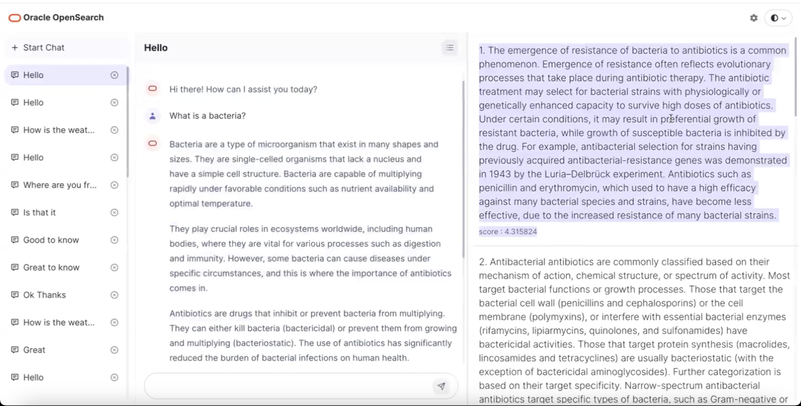
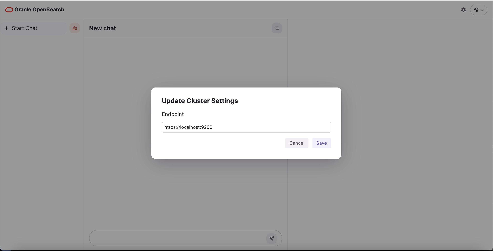
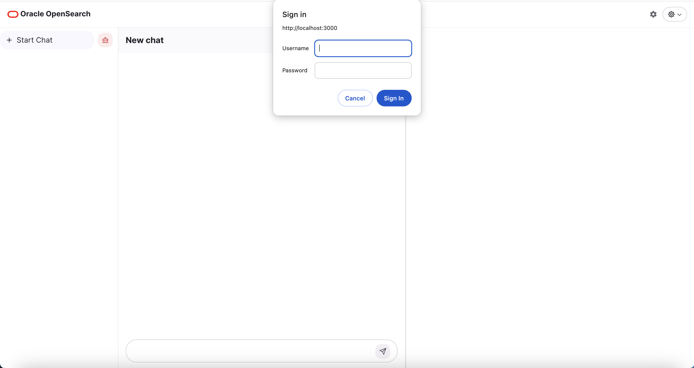

# OpenSearch Chatbot Demo UI



## Prerequisites

You need NodeJS and OCI OpenSearch Cluster Private Endpoint. 

## Development

### Running Locally

1. Install NodeJS 20.6.1.
2. Clone the repository.
3. Install dependencies with `npm install`.
4. Update the below environment variables in the ```.env.local``` to set the index name, model name and pipeline name
```
NEXT_PUBLIC_RAG_OPENSEARCH_INDEX_NAME="conversation-demo-index"
NEXT_PUBLIC_RAG_OPENSEARCH_MODEL_NAME="oci_genai/cohere.command"
NEXT_PUBLIC_RAG_OPENSEARCH_PIPELINE_NAME="demo_rag_pipeline"
```
5. Start the application using `npm run dev`.
6. Visit `http://localhost:3000` in your browser.
7. Specify the OpenSearch endpoint in the popup and it can also be changed later.

8. If your OpenSearch cluster is running in Kubernetes, You can also port forward and specify the local endpoint.
9. Only [Basic Authentication](https://developer.mozilla.org/en-US/docs/Web/HTTP/Authentication#basic_authentication_scheme) is supported. The browser will prompt for the username and password. The browser will store and handle the credentials.


## Environment Variables

| Name                                     | Required | Description                                  | Default Value            |
|------------------------------------------|----------|----------------------------------------------|--------------------------|
| NEXT_PUBLIC_RAG_OPENSEARCH_INDEX_NAME    | Yes      | Index name to be used in the search query    |                          |
| NEXT_PUBLIC_RAG_OPENSEARCH_MODEL_NAME    | Yes      | Model name to be used in the search query    | oci_genai/cohere.command |
| NEXT_PUBLIC_RAG_OPENSEARCH_PIPELINE_NAME | Yes      | Pipeline name to be used in the search query |                          |

